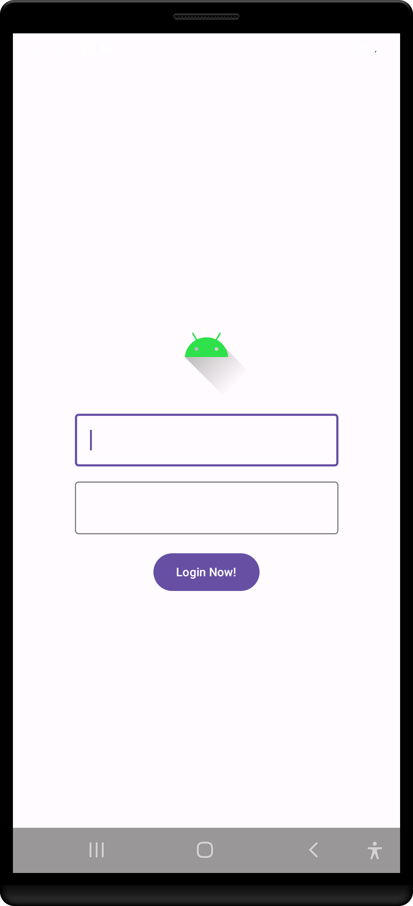

dd learnAndroid-dev
📱 Android Development Learning Repo This repository contains my Android development learning journey, with hands-on practice using Kotlin and Jetpack Compose. It includes small apps, feature demos, and experiments as I explore core Android concepts. 🚀

 

AboveEarth : What is in this project?

 

 

getTable : What is in this project?

 

 

LoginSignup Screen : What is in this project?

  
more to come yet :) !!

